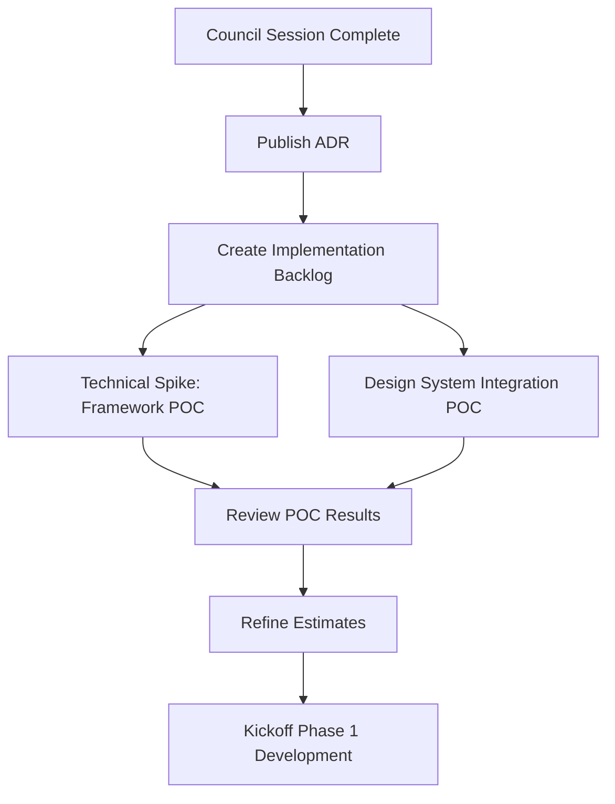

# Claude Code Integration Plan
## Adopting Prototype into Corporate UIUX-to-Liferay Workflow

**Document Version:** 1.0
**Date:** 2026-03-25
**Project:** Cloudflare Speedtest Demo → Corporate Production Application
**Target Platform:** Liferay Portal

---

## Executive Summary

This document outlines the integration strategy for adopting Claude Code-assisted development into your existing corporate workflow where UIUX designers create Figma designs, frontend developers manually code HTML/CSS/JavaScript, and applications are deployed to Liferay portal infrastructure.

**Goal:** Transform the existing Vue.js prototype into a production-ready Liferay portlet/widget that matches corporate UIUX standards while leveraging Claude Code for efficient development.

---

## Table of Contents

1. [Current State Analysis](#1-current-state-analysis)
2. [Corporate Workflow Overview](#2-corporate-workflow-overview)
3. [Integration Strategy](#3-integration-strategy)
4. [Pre-DeveloperCouncil Preparation](#4-pre-developercouncil-preparation)
5. [DeveloperCouncil Session Inputs](#5-developercouncil-session-inputs)
6. [Post-Council Implementation Workflow](#6-post-council-implementation-workflow)
7. [Success Criteria](#7-success-criteria)

---

## 1. Current State Analysis

### 1.1 Existing Prototype

**Technology Stack:**
- **Framework:** Vue.js 3 (Composition API)
- **Build Tool:** Vite
- **Language:** JavaScript (ES6+)
- **Architecture:** Component-based SPA
- **Components:** 13 Vue components
- **Styling:** CSS3 with custom styling
- **External SDK:** @cloudflare/speedtest

**Current Features:**
- Real-time network speed testing
- Interactive UI with animated progress bars
- Quality score calculations
- Data transfer tracking
- Test mode selection (Quick/Standard/Full)
- Retro-styled visual design

**Prototype Strengths:**
- ✅ Functional business logic
- ✅ Clean component architecture
- ✅ Reactive state management
- ✅ Well-documented codebase

**Prototype Limitations:**
- ❌ Not aligned with corporate design system
- ❌ Not optimized for Liferay portal
- ❌ No accessibility compliance (WCAG)
- ❌ No internationalization (i18n)
- ❌ Missing enterprise features (logging, monitoring, error handling)

---

## 2. Corporate Workflow Overview

### 2.1 Current Process

```
┌─────────────┐      ┌──────────────┐      ┌─────────────┐      ┌──────────────┐
│ UIUX Team   │      │ Frontend     │      │ QA/Testing  │      │ Liferay      │
│ (Figma)     │─────▶│ Developers   │─────▶│ Team        │─────▶│ Deployment   │
│             │      │ (Manual Code)│      │             │      │              │
└─────────────┘      └──────────────┘      └─────────────┘      └──────────────┘
     │                     │                     │                     │
     │ Design Specs        │ HTML/CSS/JS         │ Bug Reports         │ Portal Config
     │ Assets (PNG/SVG)    │ Component Library   │ UAT Feedback        │ Permission Setup
     │ Style Guide         │ Vanilla JS/jQuery   │                     │ Integration
```

### 2.2 Integration Points

**Critical Handoff Points:**
1. **Figma → Development:** Design specifications, assets, style tokens
2. **Development → QA:** Functional components, test cases
3. **QA → Deployment:** Approved build artifacts
4. **Deployment → Liferay:** Portlet/widget integration, configuration

### 2.3 Constraints

- **Liferay Requirements:**
  - Compatible with Liferay DXP version [INSERT VERSION]
  - Must be deployable as portlet/widget
  - Needs to integrate with portal authentication
  - Should respect portal theme/styling

- **Corporate Standards:**
  - WCAG 2.1 AA accessibility compliance
  - Browser support: Chrome, Firefox, Edge, Safari (last 2 versions)
  - Responsive design (mobile, tablet, desktop)
  - Corporate design system adherence
  - Security compliance (CSP, XSS prevention)

---

## 3. Integration Strategy

### 3.1 Claude Code Role in Workflow

```
┌─────────────┐      ┌──────────────────┐      ┌──────────────┐      ┌──────────────┐
│ UIUX Team   │      │ DeveloperCouncil │      │ Frontend     │      │ Liferay      │
│ (Figma)     │─────▶│ + Claude Code    │─────▶│ Developers   │─────▶│ Deployment   │
│             │      │ (AI-Assisted)    │      │ (Review/Test)│      │              │
└─────────────┘      └──────────────────┘      └──────────────┘      └──────────────┘
     │                     │                          │                     │
     │                     │                          │                     │
     │ Design Handoff      │ Code Generation          │ Manual Refinement   │ Portal Deploy
     │ + Prototype Review  │ + Architecture Review    │ + Integration       │
```

### 3.2 Benefits of Claude Code Integration

**For UIUX Designers:**
- Faster design-to-code conversion
- Prototype validation against design specs
- Design system token extraction/validation

**For Frontend Developers:**
- Reduced boilerplate coding
- Automated accessibility implementation
- Best practice guidance from DeveloperCouncil
- Faster refactoring from Vue → Liferay-compatible format

**For QA Team:**
- Better test coverage suggestions
- Edge case identification
- Automated test scaffold generation

**For DevOps/Deployment:**
- Build optimization recommendations
- Liferay integration guidance
- Configuration template generation

---

## 4. Pre-DeveloperCouncil Preparation

### 4.1 Required Artifacts from UIUX Team

**A. Figma Design Files**

Create and export the following:

```
figma-exports/
├── screens/
│   ├── speedtest-idle-state.png
│   ├── speedtest-running-state.png
│   ├── speedtest-complete-state.png
│   └── speedtest-error-state.png
├── components/
│   ├── button-primary.png
│   ├── button-secondary.png
│   ├── progress-bar.png
│   ├── metric-card.png
│   ├── quality-badge.png
│   └── mode-selector.png
├── design-specs/
│   ├── typography.md (font families, sizes, weights, line-heights)
│   ├── colors.md (color palette with hex codes)
│   ├── spacing.md (margin/padding scale)
│   ├── breakpoints.md (responsive breakpoints)
│   └── animations.md (transition timings, easing functions)
└── assets/
    ├── icons/ (SVG format)
    ├── logos/ (SVG + PNG)
    └── illustrations/
```

**B. Design Tokens Export**

Export Figma design tokens as JSON (use plugin like "Design Tokens"):

```json
{
  "colors": {
    "primary": "#0066CC",
    "secondary": "#6B7280",
    "success": "#10B981",
    "warning": "#F59E0B",
    "error": "#EF4444"
  },
  "typography": {
    "fontFamily": {
      "sans": "Inter, system-ui, sans-serif",
      "mono": "JetBrains Mono, monospace"
    },
    "fontSize": {
      "xs": "0.75rem",
      "sm": "0.875rem",
      "base": "1rem",
      "lg": "1.125rem"
    }
  },
  "spacing": {
    "xs": "0.25rem",
    "sm": "0.5rem",
    "md": "1rem",
    "lg": "1.5rem"
  }
}
```

**C. Interaction Specifications**

Document all interactions:

```markdown
## Button Interactions

### Primary Button
- Default: background-color: #0066CC, color: #FFFFFF
- Hover: background-color: #0052A3, transform: translateY(-1px)
- Active: background-color: #004080, transform: translateY(0)
- Disabled: opacity: 0.5, cursor: not-allowed
- Focus: outline: 2px solid #0066CC, outline-offset: 2px

### Animation Timings
- Transition duration: 200ms
- Easing: cubic-bezier(0.4, 0, 0.2, 1)
```

**D. Accessibility Requirements**

```markdown
## Accessibility Checklist

- [ ] Color contrast ratio ≥ 4.5:1 for normal text
- [ ] Color contrast ratio ≥ 3:1 for large text
- [ ] Focus indicators visible on all interactive elements
- [ ] Keyboard navigation support (Tab, Enter, Space, Arrow keys)
- [ ] Screen reader labels for all interactive elements
- [ ] ARIA labels for dynamic content
- [ ] Error messages associated with form fields
- [ ] Loading states announced to screen readers
```

---

### 4.2 Technical Documentation from Development Team

**A. Liferay Environment Specifications**

```yaml
# liferay-environment.yaml

liferay:
  version: "7.4.3.120 GA120" # REPLACE WITH ACTUAL VERSION
  platform: "DXP" # or "CE"

portal:
  theme: "corporate-theme-2024" # REPLACE WITH ACTUAL THEME
  deployment_type: "widget" # or "portlet"

integration:
  authentication: "portal-sso" # or "oauth2"
  api_access: "REST" # or "GraphQL"

constraints:
  max_bundle_size: "5MB"
  supported_frameworks: ["React", "Vue", "Vanilla JS"]
  css_methodology: "BEM" # or "CSS Modules"

compatibility:
  ie11_support: false
  es5_transpilation: false
  polyfills_required: []
```

**B. Corporate Frontend Standards**

```markdown
## Coding Standards

### JavaScript
- ES6+ syntax
- No jQuery dependencies (legacy portal may have it, but new code should avoid)
- Modular architecture
- JSDoc comments for public APIs

### CSS
- BEM naming convention
- Mobile-first responsive design
- No !important declarations (except for utility classes)
- CSS custom properties for theming

### HTML
- Semantic HTML5 elements
- ARIA attributes for accessibility
- Valid W3C markup

### Build Requirements
- Source maps for production debugging
- Minified and optimized bundles
- Cache-busting for static assets
- Lazy loading for code splitting
```

**C. Prototype Analysis Document**

Create a comparison document:

```markdown
# Prototype vs. Corporate Standards Gap Analysis

## Framework Compatibility

| Aspect | Current (Prototype) | Required (Corporate) | Migration Effort |
|--------|---------------------|----------------------|------------------|
| Framework | Vue.js 3 SPA | Liferay Widget (React/Vanilla) | HIGH |
| Build Tool | Vite | Webpack/Liferay bundler | MEDIUM |
| State Management | Vue Composition API | Custom/Redux | MEDIUM |
| Routing | N/A (SPA) | N/A (Widget) | LOW |
| Styling | Scoped CSS | BEM + Corporate theme | MEDIUM |

## Component Inventory

| Component | Purpose | Reusability | Notes |
|-----------|---------|-------------|-------|
| AppHeader.vue | Branding | Modify | Replace with corporate header |
| SpeedTestControls.vue | Test controls | Keep | Good abstraction |
| MetricsGrid.vue | Results display | Keep | Adapt to corporate grid |
| QualityScores.vue | Score badges | Keep | Restyle to match design |
| RetroSpeedTest.vue | Visualization | Replace | Non-corporate aesthetic |

## Business Logic Extraction

Identify framework-agnostic logic that can be preserved:

1. **Speed Test Configuration** (App.vue:90-140)
   - Measurement configs for quick/standard/full modes
   - Can be extracted to config file

2. **Data Transformation** (App.vue:260-304)
   - Results processing logic
   - Can be extracted to utility functions

3. **Event Handlers** (App.vue:161-356)
   - Start/stop test logic
   - Can be adapted to any framework

4. **Calculations** (Various components)
   - Progress bar calculations
   - Quality score mapping
   - Can be extracted to pure functions
```

---

## 5. DeveloperCouncil Session Inputs

### 5.1 Session Objective

**Primary Goal:** Review and adopt the Vue.js prototype into a production-ready Liferay widget that matches corporate UIUX design specifications.

**Success Criteria:**
- Architecture aligns with Liferay best practices
- Code follows corporate standards
- Design matches Figma specifications
- Accessibility requirements met (WCAG 2.1 AA)
- Test coverage plan approved
- Deployment strategy validated
- Security review passed

---

### 5.2 Required Input Package

Prepare a structured input package for the DeveloperCouncil:

```
developer-council-inputs/
├── 1-design-specifications/
│   ├── figma-link.md (Live Figma URL + access permissions)
│   ├── design-tokens.json
│   ├── component-specs.md
│   ├── interaction-specs.md
│   ├── accessibility-requirements.md
│   └── visual-exports/ (screenshots)
│
├── 2-current-prototype/
│   ├── source-code/ (full project)
│   ├── component-inventory.md
│   ├── architecture-diagram.png
│   ├── dependency-list.md
│   └── gap-analysis.md
│
├── 3-target-environment/
│   ├── liferay-environment.yaml
│   ├── corporate-standards.md
│   ├── deployment-checklist.md
│   ├── portal-theme-reference/ (CSS/HTML samples)
│   └── integration-requirements.md
│
├── 4-business-requirements/
│   ├── feature-requirements.md
│   ├── user-stories.md
│   ├── acceptance-criteria.md
│   └── non-functional-requirements.md
│
└── 5-session-brief/
    ├── COUNCIL_SESSION_BRIEF.md (THIS IS KEY!)
    └── review-checklist.md
```

---

### 5.3 Council Session Brief Template

**File: `developer-council-inputs/5-session-brief/COUNCIL_SESSION_BRIEF.md`**

```markdown
# DeveloperCouncil Session Brief
## Cloudflare Speedtest: Prototype to Production Adoption

**Session Date:** [SCHEDULED DATE]
**Duration:** 90-120 minutes
**Session Type:** Architecture Review + Code Adoption
**Mode:** Full Council (All 6 specialists)

---

## Session Objective

Review the Vue.js speedtest prototype and create an implementation plan to adopt it as a production Liferay widget matching corporate UIUX design standards.

---

## Context

### What We Have
- **Prototype:** Functional Vue.js 3 SPA demonstrating Cloudflare speedtest SDK
- **Design:** New Figma designs matching corporate design system
- **Target:** Liferay DXP widget for internal network diagnostics portal

### What We Need
- **Architecture decision:** Vue-in-Liferay vs. React rewrite vs. Vanilla JS
- **Migration strategy:** How to preserve business logic while changing UI
- **Implementation plan:** Step-by-step adoption roadmap
- **Quality gates:** Testing, accessibility, security validations

---

## Specialist Focus Areas

### 1. SoftwareDeveloper
**Review Focus:**
- [ ] Evaluate Vue.js → Liferay migration options
  - Option A: Vue 3 as Liferay widget (bundle with Vite)
  - Option B: React rewrite (corporate standard)
  - Option C: Vanilla JS (maximum compatibility)
- [ ] Assess business logic extraction opportunities
- [ ] Recommend state management approach for Liferay context
- [ ] Review component architecture for Liferay constraints
- [ ] Propose code organization structure

**Key Questions:**
1. Which framework approach minimizes risk and maximizes reusability?
2. How do we preserve the working business logic during migration?
3. What's the build pipeline for Liferay widget deployment?

**Input Files to Review:**
- `2-current-prototype/source-code/src/App.vue` (main logic)
- `2-current-prototype/component-inventory.md`
- `3-target-environment/liferay-environment.yaml`
- `3-target-environment/corporate-standards.md`

---

### 2. QaTester
**Review Focus:**
- [ ] Identify critical user journeys to test
- [ ] Propose test coverage strategy (unit, integration, e2e)
- [ ] Evaluate edge cases in speedtest scenarios
- [ ] Review error handling and failure modes
- [ ] Assess cross-browser/device testing requirements
- [ ] Recommend regression test approach

**Key Questions:**
1. What are the highest-risk areas that need test coverage?
2. How do we test Cloudflare SDK integration without mocking?
3. What accessibility testing tools should we use?

**Input Files to Review:**
- `2-current-prototype/source-code/src/App.vue` (test scenarios)
- `4-business-requirements/acceptance-criteria.md`
- `1-design-specifications/interaction-specs.md`

---

### 3. DatabaseEngineer
**Review Focus:**
- [ ] Evaluate if speedtest results should be persisted
- [ ] Assess data retention requirements
- [ ] Review privacy implications of storing network metrics
- [ ] Propose data schema if persistence needed
- [ ] Recommend caching strategy for test configurations

**Key Questions:**
1. Should we log speedtest results for analytics?
2. What's the data lifecycle for user network diagnostics?
3. Do we need historical trending capabilities?

**Input Files to Review:**
- `4-business-requirements/feature-requirements.md`
- `4-business-requirements/non-functional-requirements.md`

**Note:** This may be a lightweight review since the prototype is client-side only.

---

### 4. DevOpsEngineer
**Review Focus:**
- [ ] Evaluate Vite build output for Liferay compatibility
- [ ] Review bundling strategy (single bundle vs. code splitting)
- [ ] Assess CDN requirements for Cloudflare SDK
- [ ] Propose CI/CD pipeline for widget deployment
- [ ] Review monitoring and observability strategy
- [ ] Evaluate performance budgets and optimization

**Key Questions:**
1. How do we deploy Vue/React widget to Liferay portal?
2. What's the build artifact structure for Liferay widgets?
3. How do we monitor client-side performance in production?

**Input Files to Review:**
- `2-current-prototype/source-code/vite.config.js`
- `2-current-prototype/source-code/package.json`
- `3-target-environment/deployment-checklist.md`
- `3-target-environment/liferay-environment.yaml`

---

### 5. DocumentationWriter
**Review Focus:**
- [ ] Assess current code documentation quality
- [ ] Propose developer documentation structure
- [ ] Review user-facing help text/tooltips
- [ ] Evaluate API documentation needs (if exposing APIs)
- [ ] Recommend inline code comment standards
- [ ] Assess onboarding documentation for new developers

**Key Questions:**
1. What documentation do we need for future maintainers?
2. How do we document the Cloudflare SDK integration?
3. What user-facing help should be included in the widget?

**Input Files to Review:**
- `2-current-prototype/source-code/README.md`
- `2-current-prototype/source-code/src/**/*.vue`
- `1-design-specifications/component-specs.md`

---

### 6. SecurityArchitect
**Review Focus:**
- [ ] Evaluate Content Security Policy (CSP) compatibility
- [ ] Review XSS prevention measures
- [ ] Assess third-party dependency risks (@cloudflare/speedtest)
- [ ] Review data privacy implications (network metrics)
- [ ] Evaluate authentication/authorization integration
- [ ] Assess GDPR/compliance requirements

**Key Questions:**
1. Does Cloudflare SDK comply with corporate security policies?
2. What data is transmitted to Cloudflare servers?
3. How do we secure the widget in Liferay portal context?
4. Are there any PII concerns with network diagnostics?

**Input Files to Review:**
- `2-current-prototype/dependency-list.md`
- `3-target-environment/integration-requirements.md`
- `4-business-requirements/non-functional-requirements.md`

---

## Review Scope

### In Scope for This Session
✅ Architecture decision (framework choice)
✅ Component design approach
✅ Migration strategy from prototype
✅ Testing strategy
✅ Build and deployment approach
✅ Security and compliance validation
✅ Documentation requirements

### Out of Scope
❌ Detailed UI implementation
❌ Pixel-perfect design matching (separate design review)
❌ Performance optimization details (post-MVP)
❌ Advanced analytics features (future enhancement)

---

## Key Decisions Required

The council must provide recommendations on:

1. **Framework Selection**
   - [ ] Decision: Vue 3 | React | Vanilla JS
   - [ ] Rationale: [To be determined by council]
   - [ ] Migration effort estimate: [To be provided]

2. **Architecture Pattern**
   - [ ] Decision: Component architecture pattern
   - [ ] State management approach
   - [ ] Build tool configuration

3. **Implementation Phases**
   - [ ] Phase 1: [To be defined]
   - [ ] Phase 2: [To be defined]
   - [ ] Phase 3: [To be defined]

4. **Quality Gates**
   - [ ] Test coverage target: [To be defined]
   - [ ] Accessibility validation: [Tools and process]
   - [ ] Performance budget: [Metrics]
   - [ ] Security checklist: [Items to validate]

---

## Expected Outputs

At the end of the session, the council should produce:

1. **Architecture Decision Record (ADR)**
   - Framework choice with rationale
   - Component structure recommendation
   - State management approach

2. **Migration Roadmap**
   - Phase-by-phase implementation plan
   - Risk assessment and mitigation strategies
   - Effort estimates by phase

3. **Implementation Checklist**
   - Technical tasks breakdown
   - Quality gates and validation points
   - Dependencies and prerequisites

4. **Risk Register**
   - Technical risks identified
   - Security concerns flagged
   - Mitigation recommendations

---

## Pre-Session Preparation

**For All Specialists:**
1. Review the prototype code (clone repo and run locally)
2. Review Figma designs (ensure access granted)
3. Familiarize with Liferay environment specs
4. Review corporate frontend standards

**Estimated Prep Time:** 2-3 hours per specialist

---

## Session Agenda

**Part 1: Context Setting (15 min)**
- Project overview and business objectives
- Prototype demonstration
- Design review (Figma walkthrough)

**Part 2: Round 1 - Initial Assessment (30 min)**
- Each specialist provides initial findings
- Framework recommendation discussion
- Risk identification

**Part 3: Checkpoint & Discussion (15 min)**
- Clarifying questions
- Additional context from stakeholders

**Part 4: Round 2 - Cross-Specialist Debate (30 min)**
- Specialists challenge each other's assumptions
- Trade-off discussions
- Consensus building

**Part 5: Round 3 - Final Recommendations (20 min)**
- Consolidated recommendations
- Implementation roadmap draft
- Quality gates definition

**Part 6: Wrap-up (10 min)**
- Action items assignment
- Next steps
- Follow-up session scheduling

---

## Success Metrics

The session is successful if:

- [ ] Clear framework decision made with documented rationale
- [ ] Migration path from prototype to production agreed upon
- [ ] Implementation phases defined with realistic effort estimates
- [ ] Quality gates established for each phase
- [ ] All specialists confident in the proposed approach
- [ ] Security and compliance concerns addressed
- [ ] Stakeholders aligned on timeline and scope

---

## Follow-up Actions

After the session:

1. **Week 1:** Architecture Decision Record (ADR) published
2. **Week 1:** Implementation tasks created in backlog
3. **Week 2:** Technical spike for chosen framework approach
4. **Week 2:** Design system integration prototype
5. **Week 3:** First phase development kickoff

---

## Questions for Council

**Open Questions to Address:**

1. **Framework Choice:** Given Liferay's widget model, should we:
   - Keep Vue 3 and bundle it as a web component?
   - Rewrite in React (corporate standard)?
   - Simplify to Vanilla JS for maximum compatibility?

2. **Build Process:** How do we integrate Vite/Webpack output with Liferay's build system?

3. **SDK Integration:** The @cloudflare/speedtest SDK is the core dependency. How do we ensure it's:
   - Securely loaded (CSP compliance)?
   - Efficiently bundled (not duplicated across widgets)?
   - Updatable without full redeployment?

4. **State Management:** Should we:
   - Use Liferay's built-in state management?
   - Implement Redux/Zustand?
   - Keep local component state only?

5. **Testing:** How do we test the Cloudflare SDK integration?
   - Mock the SDK? (loses real-world validation)
   - Test against live Cloudflare endpoints? (requires network)
   - Hybrid approach?

6. **Design System:** How do we:
   - Import corporate design tokens?
   - Override Liferay portal theme?
   - Maintain design consistency across portal pages?

---

## Reference Materials

**Included in Input Package:**
- Prototype source code: `/2-current-prototype/source-code/`
- Figma designs: `/1-design-specifications/figma-link.md`
- Liferay specs: `/3-target-environment/`
- Business requirements: `/4-business-requirements/`

**External References:**
- Cloudflare Speedtest SDK: https://github.com/cloudflare/speedtest
- Liferay Widget Development: [INSERT CORPORATE WIKI LINK]
- Corporate Design System: [INSERT DESIGN SYSTEM LINK]
- Frontend Standards: [INSERT STANDARDS LINK]

---

## Contact Information

**Session Facilitator:** [NAME]
**UIUX Lead:** [NAME]
**Technical Lead:** [NAME]
**Product Owner:** [NAME]

**Questions before session?** Contact: [EMAIL]

---

**Prepared by:** Claude Code + Frontend Team
**Last Updated:** 2026-03-25
```

---

## 6. Post-Council Implementation Workflow

### 6.1 Immediate Next Steps (Week 1)



**Deliverables:**
1. **Architecture Decision Record (ADR)**
   - Framework choice rationale
   - Component architecture diagram
   - State management approach
   - Build pipeline definition

2. **Implementation Backlog**
   - User stories from business requirements
   - Technical tasks from council recommendations
   - Quality gates as acceptance criteria

3. **Technical Spikes**
   - POC: Chosen framework in Liferay widget
   - POC: Design token integration
   - POC: Cloudflare SDK bundling

---

### 6.2 Development Phases

**Phase 1: Foundation (2-3 weeks)**
- Set up project structure for Liferay widget
- Integrate corporate design system
- Implement basic component scaffolding
- Configure build pipeline (Vite/Webpack → Liferay)
- Set up CI/CD for widget deployment

**Phase 2: Core Features (3-4 weeks)**
- Port speedtest business logic
- Implement UI components matching Figma designs
- Integrate Cloudflare SDK
- Build state management layer
- Implement accessibility features (ARIA, keyboard nav)

**Phase 3: Quality & Integration (2-3 weeks)**
- Comprehensive testing (unit, integration, e2e)
- Accessibility audit and fixes
- Performance optimization
- Liferay portal integration testing
- Security review and fixes

**Phase 4: Deployment & Documentation (1-2 weeks)**
- User documentation
- Developer documentation
- Deployment runbook
- Training materials
- Production deployment

---

### 6.3 Claude Code Ongoing Role

**During Development:**
- **Code Generation:** Create components based on Figma specs
- **Refactoring:** Migrate Vue components to target framework
- **Testing:** Generate test scaffolds and test data
- **Documentation:** Auto-generate JSDoc and README content
- **Code Review:** Ad-hoc DeveloperCouncil sessions for complex features

**Quality Gates:**
- **Before Each Merge:** Quick council review for critical features
- **Before Phase Completion:** Full council review
- **Before Production:** Final security and compliance review

---

## 7. Success Criteria

### 7.1 Technical Success Metrics

- [ ] **Framework Integration:** Widget deploys successfully to Liferay portal
- [ ] **Design Compliance:** 100% match to Figma designs (approved by UIUX)
- [ ] **Accessibility:** WCAG 2.1 AA compliance (validated by audit tool)
- [ ] **Performance:** Initial load < 2s, TTI < 3s on 3G network
- [ ] **Test Coverage:** >80% code coverage, all critical paths tested
- [ ] **Security:** Zero high/critical vulnerabilities (SAST + DAST scans)
- [ ] **Browser Support:** Works on all required browsers (last 2 versions)
- [ ] **Bundle Size:** Widget bundle < 500KB (gzipped)

---

### 7.2 Process Success Metrics

- [ ] **Development Velocity:** 30% faster than manual coding (measured)
- [ ] **Code Quality:** <5 defects per 100 lines (post-QA)
- [ ] **Design-Dev Alignment:** <3 design revision cycles
- [ ] **Time to Production:** <10 weeks from council session
- [ ] **Developer Satisfaction:** Positive feedback on Claude Code workflow
- [ ] **Maintainability:** New developers can onboard in <2 days

---

### 7.3 Business Success Metrics

- [ ] **User Adoption:** >80% of target users try the widget within 1 month
- [ ] **User Satisfaction:** >4.0/5.0 rating in feedback surveys
- [ ] **Performance Impact:** Users report faster network diagnostics
- [ ] **Support Tickets:** <5 support tickets per 100 users in first month
- [ ] **ROI:** Development cost < traditional manual development by 25%

---

## Appendix A: Figma-to-Code Workflow with Claude Code

### Step-by-Step Process

1. **Export Design Specs from Figma**
   ```bash
   # Use Figma API or plugins to export
   - Design tokens JSON
   - Component screenshots
   - Asset files (SVG, PNG)
   ```

2. **Feed to Claude Code**
   ```
   I have Figma designs for a speedtest widget. Here are the design tokens
   and component screenshots. Please generate React/Vue components that match
   these specifications, following our corporate BEM naming convention.

   [Attach: design-tokens.json, component-specs.md, screenshots]
   ```

3. **Claude Code Generates Components**
   - Scaffolds component files
   - Applies design tokens
   - Implements responsive breakpoints
   - Adds accessibility attributes

4. **Developer Review & Refinement**
   - Review generated code
   - Adjust business logic integration
   - Fine-tune interactions
   - Add edge case handling

5. **DeveloperCouncil Spot Check**
   ```
   /developer-council quick review src/components/MetricCard.jsx
   ```

6. **Iterate Until Perfect**
   - Refine based on council feedback
   - Test in Liferay environment
   - Validate against Figma

---

## Appendix B: Sample Files

### B.1 Design Tokens Example

**File: `design-tokens.json`**
```json
{
  "$schema": "https://design-tokens.org/schema.json",
  "colors": {
    "brand": {
      "primary": { "value": "#0066CC" },
      "secondary": { "value": "#6B7280" }
    },
    "status": {
      "success": { "value": "#10B981" },
      "warning": { "value": "#F59E0B" },
      "error": { "value": "#EF4444" },
      "info": { "value": "#3B82F6" }
    },
    "neutral": {
      "50": { "value": "#F9FAFB" },
      "100": { "value": "#F3F4F6" },
      "900": { "value": "#111827" }
    }
  },
  "typography": {
    "fontFamily": {
      "sans": { "value": "Inter, -apple-system, BlinkMacSystemFont, 'Segoe UI', sans-serif" },
      "mono": { "value": "'JetBrains Mono', 'Courier New', monospace" }
    },
    "fontSize": {
      "xs": { "value": "0.75rem" },
      "sm": { "value": "0.875rem" },
      "base": { "value": "1rem" },
      "lg": { "value": "1.125rem" },
      "xl": { "value": "1.25rem" }
    },
    "fontWeight": {
      "normal": { "value": "400" },
      "medium": { "value": "500" },
      "semibold": { "value": "600" },
      "bold": { "value": "700" }
    },
    "lineHeight": {
      "tight": { "value": "1.25" },
      "normal": { "value": "1.5" },
      "relaxed": { "value": "1.75" }
    }
  },
  "spacing": {
    "xs": { "value": "0.25rem" },
    "sm": { "value": "0.5rem" },
    "md": { "value": "1rem" },
    "lg": { "value": "1.5rem" },
    "xl": { "value": "2rem" }
  },
  "borderRadius": {
    "sm": { "value": "0.25rem" },
    "md": { "value": "0.5rem" },
    "lg": { "value": "0.75rem" },
    "full": { "value": "9999px" }
  },
  "shadows": {
    "sm": { "value": "0 1px 2px 0 rgba(0, 0, 0, 0.05)" },
    "md": { "value": "0 4px 6px -1px rgba(0, 0, 0, 0.1)" },
    "lg": { "value": "0 10px 15px -3px rgba(0, 0, 0, 0.1)" }
  }
}
```

---

### B.2 Component Specification Example

**File: `component-specs/metric-card.md`**

```markdown
# Metric Card Component

## Visual Reference


## Purpose
Displays a single network metric (download speed, latency, etc.) with label, value, unit, and progress indicator.

## Anatomy

```
┌─────────────────────────────────────────┐
│  METRIC LABEL                           │
│                                         │
│  ███████████████░░░░░░░░░  75%         │
│                                         │
│  123.45 Mbps                           │
└─────────────────────────────────────────┘
```

## Properties

| Property | Type | Required | Default | Description |
|----------|------|----------|---------|-------------|
| label | string | Yes | - | Metric name (e.g., "Download Speed") |
| value | number | Yes | - | Numeric value |
| unit | string | Yes | - | Unit of measurement (e.g., "Mbps", "ms") |
| progress | number | No | 0 | Progress percentage (0-100) |
| status | enum | No | 'neutral' | 'success', 'warning', 'error', 'neutral' |
| isLoading | boolean | No | false | Show loading skeleton |

## States

### 1. Default
- Background: colors.neutral.50
- Border: 1px solid colors.neutral.200
- Border-radius: borderRadius.md
- Padding: spacing.lg

### 2. Loading
- Show skeleton loader
- Pulse animation (opacity 1 → 0.5 → 1, 2s infinite)

### 3. Hover
- Border-color: colors.brand.primary
- Box-shadow: shadows.md
- Transform: translateY(-2px)
- Transition: all 200ms ease

## Typography

- **Label:** fontSize.sm, fontWeight.medium, color: neutral.600
- **Value:** fontSize.xl, fontWeight.bold, color: neutral.900
- **Unit:** fontSize.sm, fontWeight.normal, color: neutral.500

## Progress Bar

### Appearance
- Height: 4px
- Background: colors.neutral.200
- Fill: gradient based on status
  - success: #10B981 → #059669
  - warning: #F59E0B → #D97706
  - error: #EF4444 → #DC2626
  - neutral: #3B82F6 → #2563EB

### Animation
- Transition: width 300ms cubic-bezier(0.4, 0, 0.2, 1)

## Accessibility

- Card should be focusable (tabindex="0")
- Label should be associated with value (aria-label or aria-labelledby)
- Progress should have aria-valuenow, aria-valuemin, aria-valuemax
- Status should be announced (aria-live="polite" for value changes)

## Responsive Behavior

- Mobile (< 640px): Full width, stack vertically
- Tablet (640-1024px): 2 columns grid
- Desktop (> 1024px): 3-4 columns grid

## Example Usage

```jsx
<MetricCard
  label="Download Speed"
  value={123.45}
  unit="Mbps"
  progress={75}
  status="success"
  isLoading={false}
/>
```

## Figma Link
[View in Figma](https://figma.com/file/xxx/metric-card)
```

---

### B.3 Gap Analysis Template

**File: `gap-analysis.md`**

```markdown
# Prototype vs. Corporate Standards Gap Analysis

## Executive Summary

| Category | Gaps Identified | Priority | Effort |
|----------|----------------|----------|--------|
| Framework | Vue → Target framework | HIGH | 3-4 weeks |
| Design | Retro style → Corporate | HIGH | 2-3 weeks |
| Accessibility | Partial → WCAG 2.1 AA | HIGH | 1-2 weeks |
| Documentation | Basic → Comprehensive | MEDIUM | 1 week |
| Testing | Manual → Automated | HIGH | 2 weeks |
| Security | Basic → Enterprise | HIGH | 1 week |

**Total Estimated Effort:** 10-15 weeks

---

## Detailed Gap Analysis

### 1. Framework & Architecture

| Aspect | Current | Required | Gap | Effort |
|--------|---------|----------|-----|--------|
| Framework | Vue 3 SPA | Liferay Widget (React/Vanilla) | Rewrite or adapt | HIGH |
| Build Tool | Vite | Webpack/Liferay bundler | Reconfigure | MEDIUM |
| State Mgmt | Composition API | Corporate std (Redux?) | Migrate | MEDIUM |
| Bundling | SPA bundle | Widget bundle | Restructure | MEDIUM |

**Recommendation:** [To be filled by DeveloperCouncil]

---

### 2. UI/UX Design

| Component | Current Design | Target Design | Gap | Notes |
|-----------|---------------|---------------|-----|-------|
| Header | Retro gradient | Corporate minimal | Replace | Use corporate header component |
| Buttons | Rounded, gradient | Sharp, solid | Restyle | Apply design tokens |
| Progress Bar | Retro stripes | Modern smooth | Restyle | CSS-only change |
| Colors | Custom palette | Corporate palette | Replace | Use design-tokens.json |
| Typography | Mixed fonts | Corporate font (Inter) | Replace | Update CSS variables |
| Spacing | Custom | 8px grid system | Adjust | Use spacing tokens |

**Design Compliance Score:** 30% → Target: 100%

---

### 3. Accessibility

| Requirement | Current | Required | Gap |
|-------------|---------|----------|-----|
| Semantic HTML | Partial | Full | Add ARIA labels |
| Keyboard Nav | No | Yes | Implement focus management |
| Screen Reader | No | Yes | Add ARIA live regions |
| Color Contrast | Not validated | WCAG 2.1 AA (4.5:1) | Audit & fix |
| Focus Indicators | Missing | Visible on all interactive | Add CSS |

**Current WCAG Level:** A (estimated)
**Target WCAG Level:** AA
**Effort:** 1-2 weeks

---

### 4. Code Quality

| Metric | Current | Target | Gap |
|--------|---------|--------|-----|
| Test Coverage | 0% | 80% | Write tests |
| Linting | None | ESLint (corporate config) | Configure |
| Type Safety | None (JS) | TypeScript? | Add types |
| Documentation | README only | JSDoc + guides | Write docs |
| Code Comments | Minimal | JSDoc for public APIs | Add comments |

**Effort:** 2-3 weeks

---

### 5. Security & Compliance

| Requirement | Current | Required | Gap |
|-------------|---------|----------|-----|
| CSP Compliance | Unknown | Strict CSP | Validate |
| XSS Prevention | Basic | Comprehensive | Audit |
| Dependency Scan | None | Automated (Snyk/npm audit) | Implement |
| SAST | None | SonarQube | Set up |
| Data Privacy | N/A | GDPR compliance | Document |

**Effort:** 1 week

---

### 6. Performance

| Metric | Current | Target | Gap |
|--------|---------|--------|-----|
| Bundle Size | ~500KB (unoptimized) | <300KB (gzipped) | Optimize |
| Initial Load | Unknown | <2s | Measure & optimize |
| TTI | Unknown | <3s (3G) | Measure & optimize |
| Lighthouse Score | Not measured | >90 | Optimize |

**Effort:** 1-2 weeks (post-MVP)

---

## Priority Matrix

```
HIGH PRIORITY (Must Have for MVP)
├── Framework migration
├── Design system integration
├── Accessibility compliance
├── Basic test coverage
└── Security validation

MEDIUM PRIORITY (Should Have)
├── Comprehensive documentation
├── Performance optimization
├── Advanced test coverage
└── Error monitoring

LOW PRIORITY (Nice to Have)
├── Advanced analytics
├── Internationalization
├── Dark mode support
└── PWA features
```

---

## Risk Assessment

| Risk | Probability | Impact | Mitigation |
|------|------------|--------|------------|
| Framework rewrite takes longer | HIGH | HIGH | Do POC first, validate approach |
| Design tokens don't cover all cases | MEDIUM | MEDIUM | Work closely with UIUX, define fallbacks |
| Liferay integration issues | MEDIUM | HIGH | Early integration testing, vendor support |
| Cloudflare SDK breaking changes | LOW | HIGH | Pin SDK version, monitor changelog |
| Accessibility audit fails | MEDIUM | HIGH | Incremental audits, use tools early |

---

## Recommendations

1. **Framework Choice:** [To be determined by DeveloperCouncil]
   - Consider: Build complexity, maintenance burden, team skills

2. **Phased Approach:**
   - Phase 1: POC + Architecture
   - Phase 2: Core features with design system
   - Phase 3: Quality & compliance
   - Phase 4: Optimization & deployment

3. **Quality Gates:**
   - Each phase must pass: code review, accessibility audit, security scan
   - No phase starts until previous phase completes

4. **Resource Allocation:**
   - Dedicated frontend developer (full-time)
   - UIUX designer (50% for first 2 phases)
   - QA engineer (50% from Phase 2)
   - DevOps support (as needed)

---

**Analysis Completed:** 2026-03-25
**Next Review:** After DeveloperCouncil session
```

---

## Conclusion

This integration plan provides a comprehensive framework for:

1. **Preparing** UIUX designs and technical specifications
2. **Conducting** a DeveloperCouncil session with Claude Code
3. **Implementing** the approved architecture
4. **Validating** quality at each phase
5. **Deploying** to Liferay production

**Key Success Factor:** Thorough preparation of input materials for the DeveloperCouncil session. The quality of council recommendations directly correlates with the quality of inputs provided.

**Next Steps:**
1. ✅ Review this integration plan with stakeholders
2. ⏳ Assign team members to prepare input artifacts
3. ⏳ Schedule DeveloperCouncil session (allow 2 weeks for prep)
4. ⏳ Set up shared repository for input materials
5. ⏳ Grant Figma access to all council specialists

---

**Document Prepared By:** Claude Code
**Last Updated:** 2026-03-25
**Version:** 1.0
**Status:** Draft - Awaiting Stakeholder Review
